# Module_11_Challenge

This program will allow one to analyze MercadoLibre's financial and user data in clever ways to provide insight to help the company grow. You will be able to predict search traffic so you can translate into the ability to successfully trade the stock.

---

## Technologies

This project leverages python 3.7, google colab and Facebook Prophet library. You will install pystan and fbprohet temporarily on memory in the cloud while using the program on goole colab.

!pip install pystan
!pip install fbprophet 

---

## Usage

To use this application simply clone the repository and save forecasting_net_prophet_google_colab.ipynb in the Jupyter Notebook. Then go to the https://colab.research.google.com/ to launch google colab and upload forecasting_net_prophet_google_colab.ipynb that saved to your jupyter notebook.

---

## Sample Visualization and Metrics

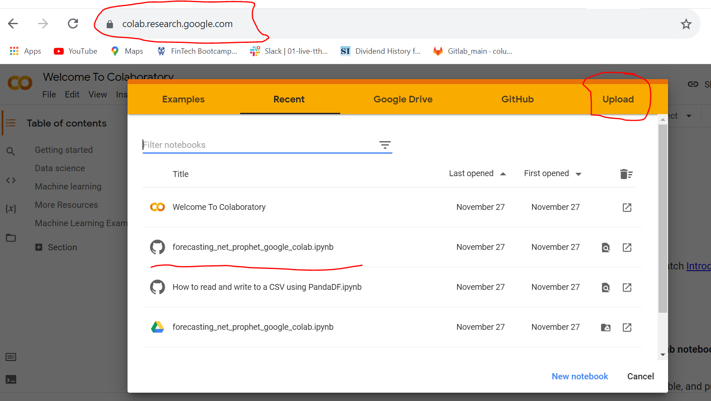
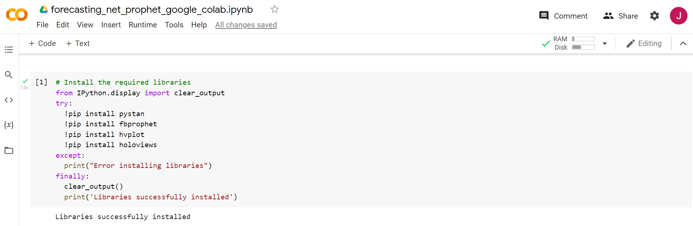
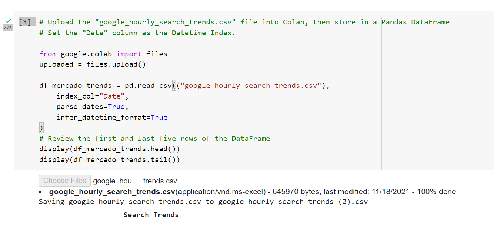
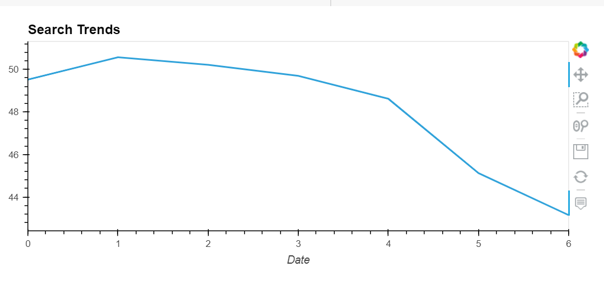
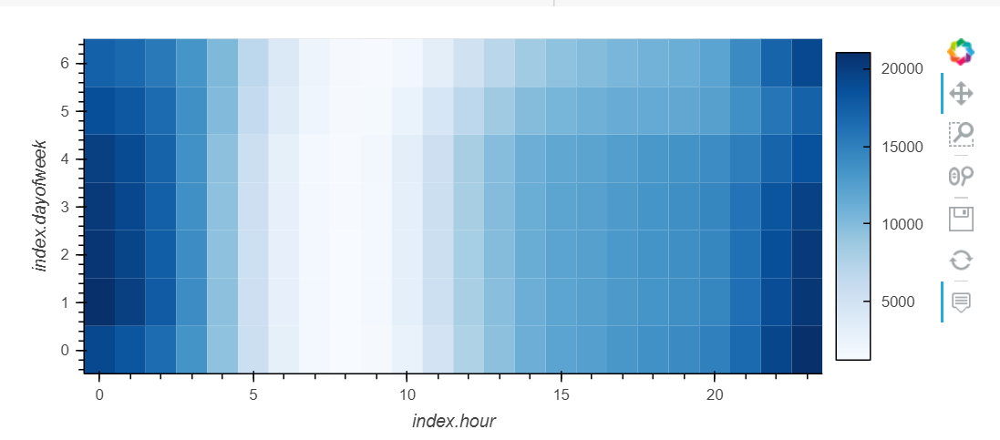
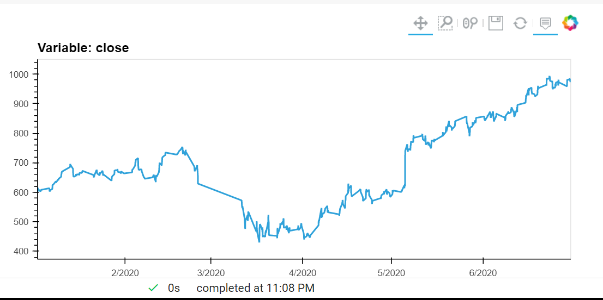

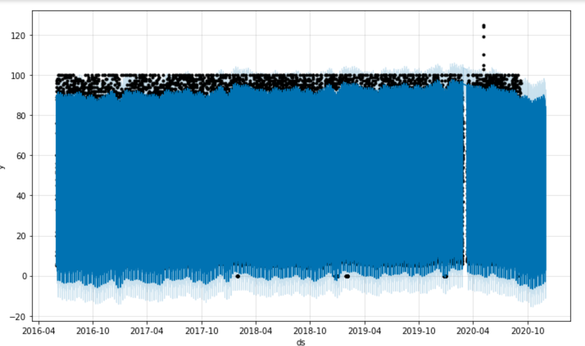
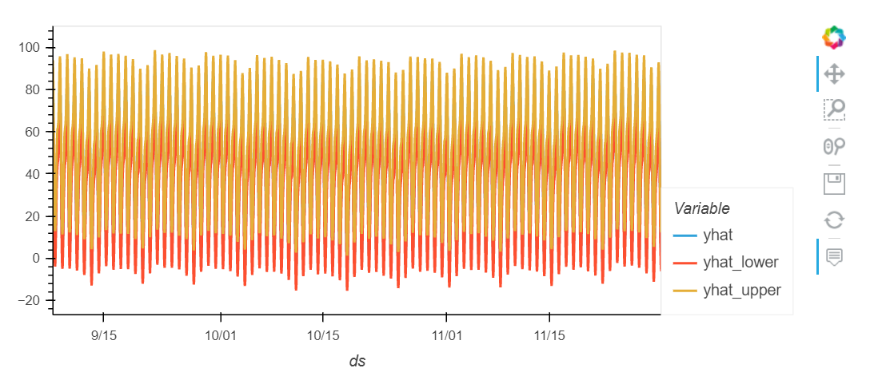
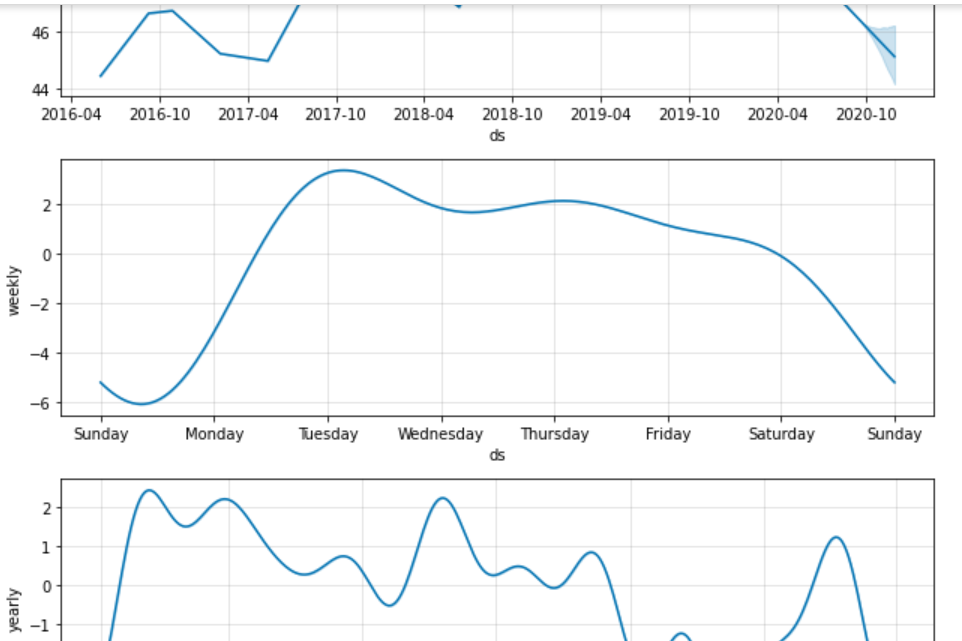
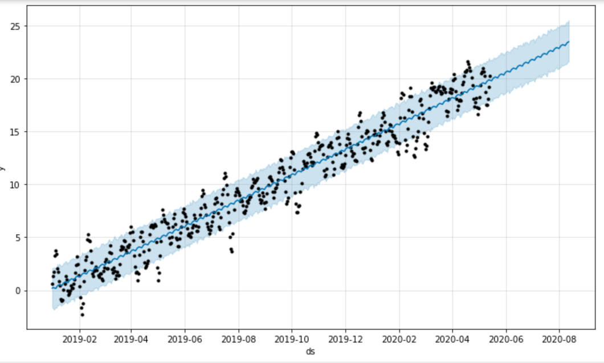
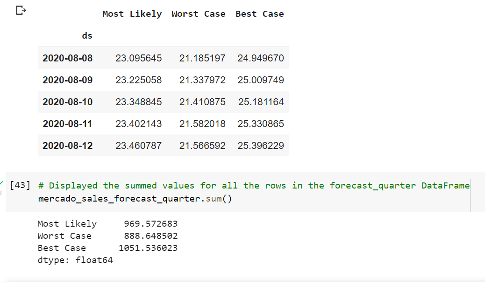

---

## Contributors

linkedin.com/in/john-sung-3675569

---

## License

MIT
