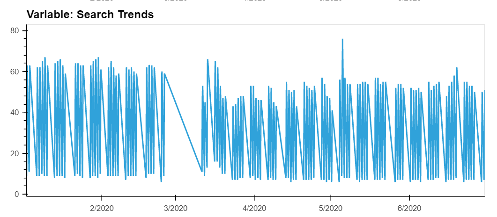

# Module_11_Challenge

This program will allow one to analyze MercadoLibre's financial and user data in clever ways to provide insight to help the company grow. You will be able to predict search traffic so you can translate into the ability to successfully trade the stock.

---

## Technologies

This project leverages python 3.7, Google Colaboratory and Facebook Prophet library. You will install pystan and fbprohet temporarily on memory in the cloud while using the program on goole colab.

!pip install pystan
!pip install fbprophet 

---

## Usage

To use this application simply clone the repository and save forecasting_net_prophet_google_colab.ipynb in the Jupyter Notebook. Then go to the https://colab.research.google.com/ to launch google colab and upload forecasting_net_prophet_google_colab.ipynb that saved to your jupyter notebook.

---

## Sample Visualization and Metrics

Get started using your jupyter notebook on Google Colab

Installing liabraries and modules on the cloud

Uploading and reading the .csv file

Plot of google search trends

Heatmap of google searches by hour

Close price during first half of 2020

Variable search trends

Plot predictions

The following 'yhat' represents Most Likely', 'yhat_lower' represents 'Worst Case' and 'yhat_upper'shows the 'Best Case' scenarios

Visualize the forecast results 

The columns 'yhat', 'yhat_lower' and 'yhat_upper'renamed to Most Likely, 'Worst Case' the 'Best Case'

---

## Contributors

linkedin.com/in/john-sung-3675569

---

## License

MIT
